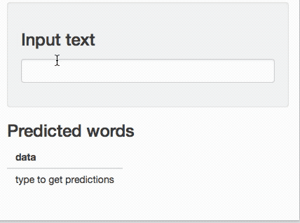

# Data Science Specialization Capstone Project

## Intro

Capstone project for Coursera / Johns Hopkins data science specialization.

## Shiny!

## Install

Data files are not committed to this repo. To run code, you need:

* Capstone dataset files in `data/final/en_US/...`
* Create 1-10% sample train/test files at `data/final/en_US_sample/(train|test)_*.txt`
* Copy banned word list (www.bannedwordlist.com) to `data/swearWords.txt`.

## Run

* `train.R` trains the model, saves model files, and scores accuracy/perplexity.
* `ui.R` and `server.R` are obviously the Shiny files.
* `final_slides.R` is the final presentation deck.
