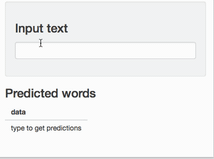

```{r setup, include=FALSE}
knitr::opts_chunk$set(echo = FALSE)
```

## 1. The Challenge

**Create a prototype predictive typing system** (e.g., word suggestions offered by mobile phone keyboards).

**Goals**

- Given part of a sentence, predict the next word (offer 3-5 best suggestions)
- Assume the input ends with a whole word
- Offer reasonable suggestions even if input has never been seen before
- Don't suggest inappropriate words

## 2. How It Works, Part I

Using some real-word example text (the "training set"), we build up knowledge about how likely each word is to follow other groups of words.

- **N-Grams**: N-grams are a "sliding window" of words where "N" is the number of words in the window. E.g., the sentence "Call me Ishmael" contains two 2-grams: "Call me", "me Ishmael". My model uses 4-grams from the training set.
- **Cleaning text**:
 * Use only top 20,000 words from training set to reduce memory use and complexity; all other words replaced with placeholder
 * Remove punctuation and capitalization, also to keep it compact ("I'm" vs "im" vs "i'm"); an autocorrect system can add them back
- **Tally N-gram Counts**: Count how often each N-gram occurs, as well as how often each word follows each N-gram.

## 3. How It Works, Part II

### Discounting and Smoothing

- _Discounting_: Reduce probabilities by a certain factor to account for words/combinations not seen in training.
- _Smoothing and Interpolation_: Model uses _Kneser-Ney smoothing_, which combines probabilities from 4-, 3-, 2-, and 1-gram tables to provide more accurate guesses and intelligently handle combinations not seen in training.

### Prediction

- We get a 3-gram input and use our 4/3/2-gram smoothed model to find most probable next words.
- If the 3-gram has never been seen before, fall back on (pre-smoothed) probabilities using 2-grams, and so on. As last resort, pick most likely single words. Each level incorporates probabilities from lower ones.

## 4. Model Performance

**Speed & Memory**

Speed ~5 predictions per second, using < 100MB RAM, good enough for proof-of-concept.

**Perplexity**

"Perplexity" = mismatch between model's probabilities of previously unseen n-grams and actual. Lower is better. My model scores **275**. Best known n-gram models using larger datasets score about **250**, so we are doing quite well.

**Top-3 Prediction Accuracy**

Using 4-grams from a new dataset, what % of the time is the 4th word one of the model's top-3 predictions?

- My model: ~21% accuracy (training set: 724,000 words; test set: 1000 random 4-grams & frequencies from 310,000 words)
- More than 2x better than the baseline (baseline = always predicting 3 most common words)

## 5. Demo Time!

Demo at: <https://jnmiller.shinyapps.io/capstone/>. Start typing, get predictions with probabilities.

```{r, out.width = "400px"}

```

**Next steps**

- Incorporate n-gram frequencies pre-calculated from larger datasets (www.ngrams.info, Google Books ngrams data)
- Improve performance/memory-usage with smarter data structures (trie)
- Investigate character-level neural network (LSTM) models using MxNet for R